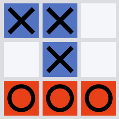

# tictactoe.webxdc



a tic tac toe webxdc app.

### Features:

- Multiple games at once
- spectate running games
- rudimentary "Matchmaking"
- Sound (some tone's to test sound)


### Things that could be improved:

- add resilience against message loss
- code quality (it's a bit messy for my tastes)
- player-tags are not aligned on long names
- update player names when they change during a game

## Developing

type-check the project

```
npm i -g typescript
tsc --noEmit --allowJs --lib es2015,dom *.js
```
