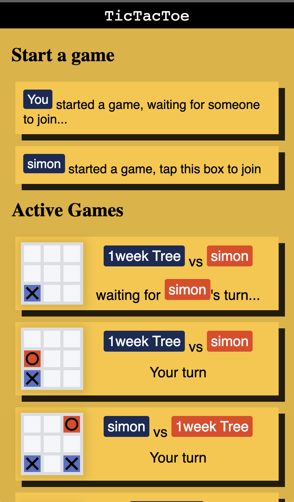

# Tic Tac Toe


a tic tac toe webxdc app.

### Features:

- Multiple games at once
- spectate running games
- rudimentary "Matchmaking"
- Sound (some tone's to test sound)



### Things that could be improved:

- add resilience against message loss
- code quality (it's a bit messy for my tastes)
- player-tags are not aligned on long names
- update player names when they change during a game

## Developing

### Installing Dependencies

After cloning this repo for the first time, install dependecies:

```
npm install
```

### Running tests

```
npm run format:check
npm test
```

type-check the project

```
npm i -g typescript
tsc --noEmit --allowJs --lib es2015,dom *.js
```

### Testing the app in the browser

To test your work in your browser (with hot reloading!) while developing:

```
npm dev-mini
# Alternatively to test in a more advanced WebXDC emulator:
npm run dev
```

### Building

To package your WebXDC file:

```
pnpm build
```

To package your WebXDC with developer tools inside to debug in Delta Chat, set the `NODE_ENV`
environment variable to "debug":

```
NODE_ENV=debug pnpm build
```

The resulting optimized `.xdc` file is saved in `dist-xdc/` folder.

### Releasing

To automatically build and create a new GitHub release with your `.xdc` file:

```
git tag -a v1.0.1
git push origin v1.0.1
```
